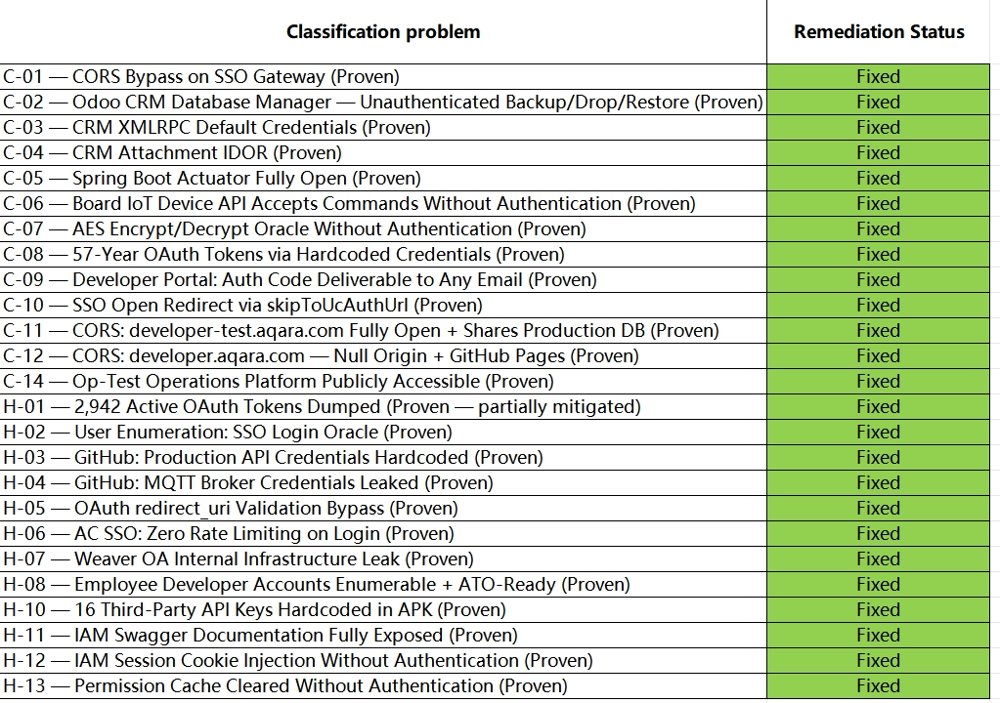

# Disclosure Timeline — Aqara / Lumi United Technology

This is the chronology of contact between me (Sammy Azdoufal, independent researcher) and Lumi United Technology Co., Ltd. (Shenzhen) regarding the ten CVEs and the operator-side findings published in the [README](README.md).

Every line attributed to Aqara below is quoted **verbatim** from the email thread on `security@aqara.com`. No employee names. No third-party email content.

---

## Part 1 — Seventeen Days In Spam (March 13 → March 30)

The audit started on **2026-03-12**. By the next evening I had enough to know it was bad — and not in the abstract way that security findings usually are. Aqara makes smart locks. Millions of them, installed in front doors across Europe, North America, and Asia, many of them paired with HomeKit. What I was looking at was a four-step, fully unauthenticated chain that ends at `POST open-cn.aqara.com/v3.0/open/api` with the ability to send commands to any device on the platform. Including the locks.

The infrastructure findings were there too — a Spring Boot Actuator returning the entire Kubernetes topology, a CRM running `admin:admin`, a developer endpoint that emails an account-creation code to any address you ask it to. But those felt secondary. The thing that made me stop opening tabs and start writing the email was simpler: from a laptop, with no Aqara account, no physical device, no prior access of any kind, you could unlock the front door of any home running an Aqara smart lock on the platform. Every home. At once. From anywhere.

**2026-03-13, 02:09** — First contact. A short email asking for the preferred secure channel for vulnerability reports.

No reply.

**2026-03-22** — Nine days in, follow-up:

> *"Nobody interested? We will happily go for full disclosure if nobody answers properly how you handle security incidents."*

No reply.

**2026-03-30, 23:20** — Seventeen days in. Sharper:

> *"I will start to contact press end of the week if you don't dare to answer. (...) This isn't serious."*

That worked.

---

## Part 2 — The Spam Filter Excuse (March 31)

Aqara's first reply lands the following morning. They open with an apology, attribute the silence to a spam filter, and frame the rest cleanly:

> *"Please accept our sincerest apologies for the delay in responding to your inquiry regarding vulnerabilities in Aqara products. Your email was unfortunately intercepted by our overseas spam filter, which prevented us from addressing it promptly."*

For the record: a "press contact" threat made it through the same spam filter in under 24 hours. Whatever the filter was tuned to ignore, it wasn't tuned to ignore reputational risk.

I reply within hours:

> *"I would like to report these findings responsibly. Could you please let me know how?"*

Aqara, same day:

> *"Please share the full technical details of your findings (including reproduction steps, affected versions, screenshots, or proof-of-concept) directly to this email address. Our security team will review your report immediately, conduct a full assessment according to industry standards, and keep you updated on our progress."*

---

## Part 3 — The Report (April 1)

**2026-04-01** — Full report sent. PDF attached, technical summary in the email body. The chain is laid out in four steps, the operator-side findings are listed separately, the disclosure timeline is stated:

> *"I work on a 90-day window from first vendor contact. On CVEs: I can handle assignment myself or hand it off to your team, whichever is easier."*

Aqara's same-day reply:

> *"Thank you for your detailed report and for following responsible disclosure practices. We have duly received your findings and are currently conducting an internal review and technical assessment. Our security team will process this with high priority and get back to you with our findings and next steps as soon as possible."*

This is the right answer. After 17 days of spam-filter silence and one threat-to-go-to-press, the engagement from this point onward is, for the most part, professional.

---

## Part 4 — Remediation In Progress (April 8 → April 20)

Seven days of silence pass. On **April 8, 00:03** I ping:

> *"Could you please keep me updated? It's been a week now..."*

Aqara replies the same day. They've started fixing things:

> *"We have received your vulnerability report and immediately initiated the remediation process. Our engineering team has deployed relevant fixes, which are currently under internal verification and testing to ensure the issues are fully and effectively resolved. Regarding the issue marked as Immediate (within 24h), we have prioritized its resolution and completed the required fix on schedule."*

I reply same-day asking for specifics: which findings are fixed and which are still in progress, an offer to re-test from my side, and a reminder of the **2026-06-11** disclosure deadline.

**April 9** — Aqara responds:

> *"We are currently conducting system remediation testing and finalizing the issue fix list. We will get back to you promptly once these are confirmed."*

**April 20, 04:05** — Aqara: initial remediation complete on most items, asks for more PoC on H-09 (Discourse forum):

> *"We have carried out initial remediation measures and internal preliminary verification on the addressed items. We welcome you to perform independent re-testing to assess the current fix status. As for the remaining unresolved issue, we hope you could provide more detailed reproduction steps, complete exploitation process and relevant Proof of Concept to support our internal in-depth analysis and validation. H-09 — Discourse Forum: 194K Users Fully Searchable (Proven), We will continue to follow up on subsequent progress and keep you updated accordingly."*

Attached to that same email: a formal acknowledgment table mapping each of the 14 Critical and 12 High findings (H-09 omitted) to a remediation status. Every line marked **Fixed**. In the same email, the invitation to "perform independent re-testing." The order of operations is worth noticing — the table marks the work done, then asks the researcher to verify it.

This is the most consequential single artefact of the disclosure thread. It is a written, on-the-record acknowledgment by Aqara's security team that the 26 listed findings exist, were reproduced internally, and were patched. It removes any subsequent argument over whether the bugs are real, whether they meet a severity bar, or whether they warrant CVEs. The CVE coordination through runZero proceeds on this footing.

Two caveats worth noting on the table:

1. **H-09 is missing.** The Discourse forum exposing 194,654 user accounts and 309,373 posts via unauthenticated JSON API is the only finding from my report not present on the table. Aqara had asked for additional PoC on this item in the same April 20 email; I provided it that day. It does not appear in the acknowledgment, neither as Fixed nor as Open.
2. **C-13 (Hardcoded crypto keys in `liblumidevsdk.so`) is marked Fixed.** That claim is technically improbable: the keys are baked into the native library shipped with every Aqara Home installation and into the firmware of every deployed device. A server-side patch cannot rotate them. Either Aqara has shipped a coordinated firmware + app update (in which case the rotation should be observable in a fresh APK pull and a fresh device fingerprint), or the "Fixed" status here is aspirational. To be clarified before publication.

**April 20, 09:52** — I send the H-09 reproduction steps: the Discourse JSON API endpoints exposing the user/post enumeration, plus the `login_required` Discourse setting that fixes it.

---

## Part 5 — What's Open, What's Closed (re-test April 20, 2026)

**Independently verified as closed (re-tested March 30 and April 20):**

| Finding | Status |
|---------|--------|
| C-02 — CRM database manager | ✅ Fixed — HTTP 0, firewalled |
| C-04 — CRM attachment IDOR | ✅ Fixed — 0/5 IDs accessible |
| C-11 — CORS developer-test.aqara.com | ✅ Fixed — ACAO absent |
| C-12 — CORS developer.aqara.com null origin | ✅ Fixed — HTTP 403 |
| C-14 — op-test operations platform | ✅ Fixed — unreachable |
| H-01 — OAuth token dump | ✅ Fixed — returns code:600 (session required) |
| H-08 — Employee developer account registration | ✅ Fixed — code:302 |

**Confirmed still vulnerable at re-test (April 20):**

| Finding | CVE | Evidence |
|---------|-----|----------|
| CHAIN-SIGN — signing formula | CVE-2026-50084 | code:2002 — signature still accepted |
| C-01 — CORS gw-builder.aqara.com | CVE-2026-50087 | ACAO: evil.com + ACAC: true |
| C-07 — AES oracle | CVE-2026-50086 | Encrypt/decrypt round-trip confirmed |
| H-02 — User enumeration oracle | — | code:10024 vs code:10023 differential intact |
| H-05 — OAuth redirect_uri bypass | CVE-2026-50090 | aqara.com.evil.com passes validation |
| H-06 — AC SSO zero rate limiting | — | 5 rapid attempts, no block |
| H-09 — Discourse forum | — | 210,287 users (growing) |
| H-12 — Cookie injection endpoint | — | HTTP 200, no auth |
| H-13 — Permission cache clear | — | HTTP 200, no auth |

**Vendor claim disputable on technical grounds:**

- **C-13 / CVE-2026-50091** (hardcoded crypto keys in `liblumidevsdk.so`) marked Fixed by vendor. Server-side patches cannot rotate keys embedded in deployed mobile binary and device firmware. Verifiable only via a fresh coordinated app + firmware release; not independently confirmed.

**Conspicuously absent from the acknowledgment table:**

- **H-09** (Discourse forum, now 210,287 users searchable via JSON API) — PoC provided April 20, same day as the acknowledgment table. Not present in the table, neither as Fixed nor as Open. At publication the forum remains publicly searchable without authentication.

---

## Part 6 — The Intermediary (May 19 → June 11, 2026)

On **May 19**, Aqara's security team sent a new email formally redirecting all compensation and case-related communications to **HackProve** (`partner@hackprove.com`), a Chinese-operated bug bounty platform:

> *"To handle vulnerability reports and remediation in a more professional and standardized manner, we are establishing a formal vulnerability response process and system. We are pleased to inform you that we have now partnered with the overseas security response platform Hackprove. Going forward, all follow-up communications and matters related to this case will be coordinated through the platform."*

The order of operations here is worth documenting.

HackProve had first contacted me on **April 8** — five weeks before Aqara's official redirect email — under the guise of a speaking invitation to their Macau security conference (HPW 2026). At that point they presented themselves solely as conference organisers and did not mention any relationship with Aqara.

On **April 15**, the same HackProve representative disclosed that Aqara had in fact "approached" them and asked them to help mediate the case:

> *"Aqara has approached us. At the moment, they don't have the capability to build or operate a vulnerability bounty program, nor to manage reward payouts internally. As a result, they're looking to collaborate with us, and it's likely that we will take the lead in further communications."*

When I asked for written proof that HackProve's involvement was linked to my specific findings — an email, a forwarded communication, anything in writing — none was produced. They indicated that all communication with Aqara had taken place over WeChat, offered to share screenshots, and noted that their on-site team had visited Aqara in person. One message in the WeChat thread shared as evidence had been deleted before it was shown to me.

Aqara's official written acknowledgment of the HackProve arrangement came only on **May 19** — five weeks after HackProve was already claiming to act as their representative.

In the course of the bounty negotiation, HackProve stated that Aqara's position was that they wished to acquire the research and prevent publication. After confirming they were acting as Aqara's representative on this case, they presented a formal bounty offer on **May 21**:

| Category | Rate | Count | Subtotal |
|----------|------|-------|----------|
| Critical (tier 1) | $300 | 4 | $1,200 |
| Critical (tier 2) | $100 | 15 | $1,500 |
| Critical (tier 3) | $20 | 1 | $20 |
| General (tier 1) | $50 | 5 | $250 |
| General (tier 2) | $10 | 2 | $20 |
| **Total** | | | **$2,990** |

For context: the scope includes ten CVEs, four of which chain into unauthenticated read/write control of every Aqara device worldwide, plus eleven operator-side findings acknowledged as Fixed by Aqara's own engineering team. The offer was declined.

Negotiations were ongoing as of the June 11 publication date. The disclosure deadline was not extended.

**CVE IDs confirmed by runZero (Tod Beardsley) — late May 2026:**

CVE-2026-50082, CVE-2026-50083, CVE-2026-50084, CVE-2026-50085, CVE-2026-50086, CVE-2026-50087, CVE-2026-50088, CVE-2026-50089, CVE-2026-50090, CVE-2026-50091

---

## Part 7 — Note on Methodology

Every date and quote in this document is taken from the email thread between me and `security@aqara.com` and from HackProve's formal written communications. No employee names, no personal email addresses other than security aliases, are reproduced. Quoted lines are verbatim, including original capitalisation and punctuation; ellipses indicate elision for length, never for sense.

The audit findings were independently coordinated through:

- **runZero, Inc.** — Tod Beardsley (`todb`), CVE coordinator. Ten CVEs confirmed (CVE-2026-50082 through CVE-2026-50091).
- **Press** — The Verge.

The June 11, 2026 publication date follows the standard 90-day window from first vendor contact (March 13, 2026). Aqara has been on notice of this date since the April 1 report and the explicit reminder in the April 8 follow-up.

---

*Back to [README](README.md).*
